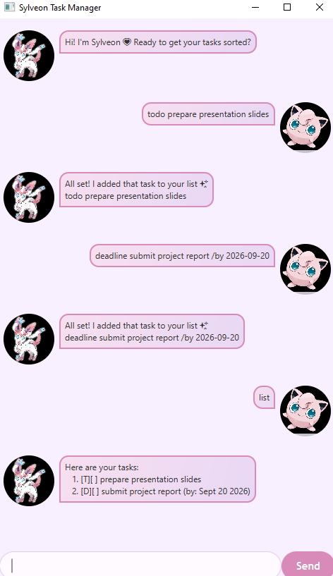

# Sylveon User Guide

Sylveon is a friendly task-management chatbot. Type a command in the chat box and
press Enter to manage your tasks.

## Quick start

Type `help` to see the available commands. Sylveon saves changes automatically, so
your task list is available the next time you start the application.

Some commands you can try:

- `todo read chapter 1` adds a todo.
- `list` displays all tasks.
- `mark 1` marks the first displayed task as done.
- `bye` exits Sylveon.

## Features

### Adding tasks: `todo`, `deadline`, and `event`

Add a simple todo:

Format: `todo DESCRIPTION`

Example: `todo read chapter 1`

Add a deadline. Dates must use the `yyyy-mm-dd` format:

Format: `deadline DESCRIPTION /by DATE`

Example: `deadline submit project proposal /by 2026-09-30`

Add an event with a start and end date:

Format: `event DESCRIPTION /from START_DATE /to END_DATE`

Example: `event project meeting /from 2026-09-15 /to 2026-09-15`

An event cannot end before it starts. Each new task is saved automatically.

### Listing tasks: `list`

Displays all tasks, with each task assigned a number:

`list`

### Finding tasks: `find`

Finds tasks whose descriptions contain a keyword:

Format: `find KEYWORD`

Example: `find project`

The matching tasks are displayed with numbers that can be used with `mark`,
`unmark`, or `delete`.

### Completing tasks: `mark` and `unmark`

Mark a displayed task as done or not done:

- `mark 1` marks task 1 as done.
- `unmark 1` marks task 1 as not done.

### Deleting tasks: `delete`

Deletes the task with the specified displayed number:

`delete 1`

The deletion is saved automatically.

### Sorting tasks: `sort`

Sort all tasks alphabetically:

`sort`

Sort one type of task:

- `sort todo` sorts todos alphabetically.
- `sort deadline` sorts deadlines by date, earliest first.
- `sort event` sorts events by date, earliest first.

Sorting is saved automatically. The displayed numbers can be used with `mark`,
`unmark`, or `delete`.

### Getting help and exiting: `help` and `bye`

- `help` shows the command formats.
- `bye` exits the application.

## Command summary

| Command | Purpose |
| --- | --- |
| `todo DESCRIPTION` | Add a todo |
| `deadline DESCRIPTION /by DATE` | Add a deadline |
| `event DESCRIPTION /from DATE /to DATE` | Add an event |
| `list` | Show all tasks |
| `find KEYWORD` | Find matching tasks |
| `mark NUMBER` | Mark a task as done |
| `unmark NUMBER` | Mark a task as not done |
| `delete NUMBER` | Delete a task |
| `sort` | Sort all tasks alphabetically |
| `sort todo/deadline/event` | Sort a specific task type |
| `help` | Show command formats |
| `bye` | Exit Sylveon |

## Tips

- Use the exact date format `yyyy-mm-dd`, such as `2026-09-30`.
- Use the number shown in the current list or search results for `mark`, `unmark`,
  and `delete`.
- If a command is rejected, read Sylveon's error message and check its format.
